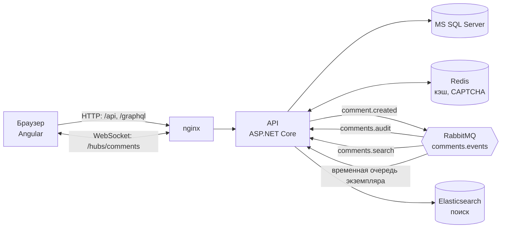
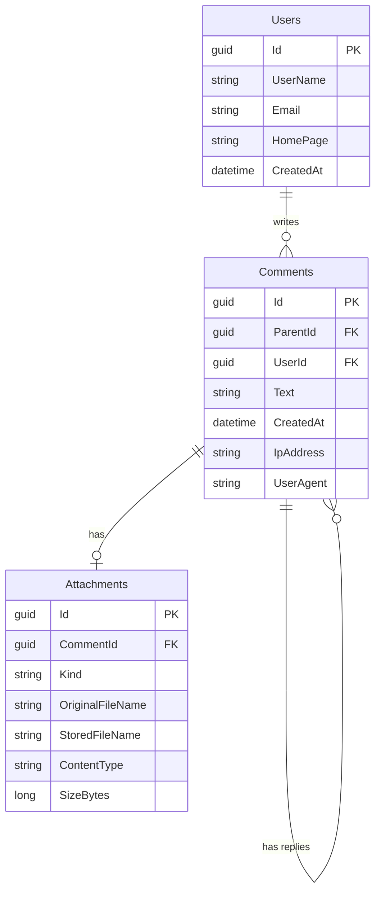

# Comments

SPA-приложение «Комментарии»: пользователи оставляют сообщения с каскадными ответами, картинками и текстовыми файлами. Все данные, включая сведения о клиенте (IP-адрес и User-Agent), сохраняются в реляционной базе данных.

Серверная часть: ASP.NET Core (.NET 10) + Entity Framework Core + MS SQL Server. Клиентская часть: Angular 22. Дополнительно: кэш на Redis, события и очередь сообщений на RabbitMQ, обновления в реальном времени через WebSocket (SignalR), GraphQL-эндпоинт и полнотекстовый поиск на Elasticsearch. Всё упаковано в Docker.

## Демо

- Приложение: `<ссылка на развёрнутое приложение>`
- Видео работы: `<ссылка на видео>`

## Возможности

- **Форма комментария**
  - `User Name` (латиница и цифры) и `E-mail`: обязательные поля.
  - `Home page` (URL): необязательное поле.
  - `CAPTCHA`: картинка с кодом из латинских букв и цифр, одноразовая, действует 5 минут.
  - `Text`: обязательное поле, разрешены только теги `<a href="" title="">`, `<code>`, `<i>`, `<strong>`.
  - Панель кнопок `[i]`, `[strong]`, `[code]`, `[a]` и предпросмотр сообщения без перезагрузки страницы.
  - Валидация на клиенте и на сервере.
- **Главная страница**
  - Заглавные комментарии выводятся с сортировкой по `User Name`, `E-mail` и дате (в обе стороны). По умолчанию новые сверху (LIFO).
  - 25 комментариев на странице.
  - Каскадные ответы: на любой комментарий можно отвечать неограниченное число раз.
- **Файлы**
  - Картинки JPG, GIF, PNG: пропорционально уменьшаются до 320×240 (GIF сохраняется как PNG, анимация не поддерживается).
  - Текстовые файлы TXT до 100 КБ.
  - Просмотр файлов с визуальными эффектами (lightbox).
- **Кэш (Redis).** Список комментариев кэшируется, кэш сбрасывается при появлении нового комментария. Сбой Redis не роняет запросы.
- **События и очередь (RabbitMQ).** Создание комментария порождает событие `CommentCreated`, которое уходит в очередь и обрабатывается независимыми потребителями (аудит, поиск, рассылка в реальном времени).
- **Реальное время (WebSocket, SignalR).** Когда кто-то оставляет комментарий, у остальных посетителей над списком появляется плашка «Появились новые комментарии».
- **GraphQL.** Те же данные доступны через `/graphql` (Hot Chocolate).
- **Поиск (Elasticsearch).** Полнотекстовый поиск по тексту и именам авторов с учётом морфологии русского языка.

## Архитектура



Создание комментария (`POST /api/comments`) проходит такие шаги:

1. Валидация данных (FluentValidation), включая проверку, что теги закрыты и вложены правильно.
2. Проверка CAPTCHA (одноразовая, хранится в Redis).
3. Проверка родительского комментария (для ответов).
4. Очистка текста санитайзером, обработка файла по его содержимому.
5. Поиск или создание пользователя по паре `UserName` + `E-mail`, запись комментария с IP-адресом и User-Agent, сохранение файла.
6. Событие `CommentCreated` передаётся обработчикам по порядку: сначала синхронно сбрасывается кэш списка (чтобы автор сразу увидел свой комментарий), затем сообщение публикуется в RabbitMQ.
7. Потребители очереди работают независимо от запроса:

| Очередь | Назначение |
|---|---|
| `comments.audit` | Запись в лог (`Audit: comment ...`) |
| `comments.search` | Индексация комментария в Elasticsearch |
| временная, своя у каждого экземпляра API | Рассылка уведомления браузерам через SignalR |

Обменник `comments.events` (тип `topic`), ключ маршрутизации `comment.created`. Сообщения, которые не удалось обработать, не теряются: очереди `comments.audit` и `comments.search` настроены с dead-letter обменником `comments.events.dlx`, откуда они попадают в очередь `comments.dead-letter`. У рассылки в реальном времени очередь временная и эксклюзивная для каждого экземпляра API, поэтому уведомление получают клиенты всех экземпляров и отдельный backplane для SignalR не нужен.

## Стек

| Область | Технологии |
|---|---|
| Backend | .NET 10, ASP.NET Core Web API, Entity Framework Core |
| База данных | MS SQL Server 2022 |
| Кэш | Redis 7 |
| Очередь сообщений | RabbitMQ 4 (`RabbitMQ.Client` 7.x) |
| Реальное время | SignalR (WebSocket) |
| GraphQL | Hot Chocolate |
| Поиск | Elasticsearch 9 (`Elastic.Clients.Elasticsearch`) |
| Frontend | Angular 22 (standalone-компоненты, signals), SCSS, `@microsoft/signalr` |
| Валидация | FluentValidation, собственный валидатор XHTML-разметки |
| Защита от XSS | HtmlSanitizer (белый список тегов) |
| Изображения и CAPTCHA | SkiaSharp |
| Тесты | xUnit (backend), Vitest через Angular CLI (frontend) |
| Инфраструктура | Docker, Docker Compose, nginx |

## Быстрый старт (Docker)

Нужен только установленный Docker (с Docker Compose). Для Elasticsearch рекомендуется отдать Docker не менее 4 ГБ оперативной памяти.

```bash
git clone https://github.com/maksimka1267/Comments.git
cd Comments
docker compose up --build
```

Первая сборка занимает несколько минут. API запускается после того, как база данных, Redis, RabbitMQ и Elasticsearch пройдут проверки готовности. Когда все контейнеры запустятся, откройте **http://localhost:8080**.

База данных создаётся и обновляется автоматически при старте API, поисковый индекс при старте наполняется существующими комментариями. Данные и загруженные файлы хранятся в Docker-томах и переживают перезапуск.

Полная очистка вместе с данными:

```bash
docker compose down -v
```

### Сервисы

| Сервис | Порт на хосте | Назначение |
|---|---|---|
| `web` | `8080` (`WEB_PORT`) | nginx: раздаёт Angular и проксирует `/api`, `/graphql`, `/hubs` на API |
| `api` | внутри сети | ASP.NET Core (контейнер слушает 8080) |
| `mssql` | `1433` | MS SQL Server 2022 |
| `redis` | `6379` | кэш и хранилище CAPTCHA |
| `rabbitmq` | `5672`, `15672` | брокер; веб-интерфейс управления на http://localhost:15672 (пользователь `comments`, пароль из `RABBITMQ_PASSWORD`) |
| `elasticsearch` | `9200` | поисковый индекс (безопасность выключена, только для разработки и демо) |

Порты баз данных, брокера и Elasticsearch нужны для разработки с локальным API. На сервере их стоит убрать из `docker-compose.yml`.

### Конфигурация

Значения по умолчанию подходят для локального запуска. Для сервера их можно переопределить в файле `.env` рядом с `docker-compose.yml` (шаблон: `.env.example`):

| Переменная | По умолчанию | Назначение |
|---|---|---|
| `MSSQL_SA_PASSWORD` | `Comments_Dev123!` | Пароль администратора SQL Server (должен проходить требования сложности) |
| `RABBITMQ_PASSWORD` | `comments_dev` | Пароль пользователя `comments` в RabbitMQ |
| `WEB_PORT` | `8080` | Порт, на котором доступно приложение |

Настройки API (задаются переменными окружения контейнера `api`):

| Переменная | Назначение |
|---|---|
| `ConnectionStrings__Default` | Строка подключения к MS SQL Server |
| `ConnectionStrings__Redis` | Адрес Redis |
| `ConnectionStrings__RabbitMq` | URI RabbitMQ (`amqp://...`) |
| `ConnectionStrings__Elasticsearch` | Адрес Elasticsearch |
| `FileStorage__RootPath` | Каталог для загруженных файлов |
| `MigrateOnStartup` | `true`: применять миграции при старте |
| `Search__ReindexOnStartup` | `false`: не переиндексировать комментарии при старте (по умолчанию включено) |

## Разработка без Docker для приложения

Нужны: .NET 10 SDK, Node.js 22.12+ (или 24) и Docker для инфраструктуры.

1. Запустить инфраструктуру:

   ```bash
   docker compose up -d mssql redis rabbitmq elasticsearch
   ```

2. Применить миграции и запустить API (профиль `https`, порт указан в `src/Comments.Api/Properties/launchSettings.json`). Строки подключения по умолчанию в `appsettings.json` смотрят на `localhost`:

   ```bash
   dotnet tool restore
   dotnet ef database update --project src/Comments.Infrastructure --startup-project src/Comments.Api
   dotnet run --project src/Comments.Api --launch-profile https
   ```

3. Запустить фронтенд (запросы `/api`, `/graphql` и `/hubs` проксируются на API через `web/proxy.conf.json`):

   ```bash
   cd web
   npm ci
   npm start
   ```

   Приложение откроется на http://localhost:4200. Если порт API отличается от `7186`, поправьте `target` в `web/proxy.conf.json`.

## Тесты

```bash
dotnet test                          # backend
cd web && npm test -- --watch=false  # frontend
```

Backend-тесты не требуют запущенной инфраструктуры (используются EF Core InMemory и заглушки).

## API

| Метод и путь | Описание |
|---|---|
| `GET /api/comments?sortBy=date\|userName\|email&sortDir=asc\|desc&page=1` | Страница заглавных комментариев (25 шт.) вместе с деревом ответов |
| `GET /api/comments/{id}` | Комментарий со всей веткой ответов |
| `GET /api/comments/search?q=текст&page=1` | Полнотекстовый поиск (25 на страницу, страницы до 400) |
| `POST /api/comments` | Создание комментария (`multipart/form-data`) |
| `GET /api/captcha` | Новая CAPTCHA: идентификатор и картинка (data-URI) |
| `GET /api/attachments/{id}` | Файл вложения |
| `POST /graphql` | GraphQL-запросы (в браузере по тому же адресу открывается встроенный интерфейс) |
| `/hubs/comments` | Хаб SignalR для обновлений в реальном времени |

Поля `POST /api/comments`: `userName`, `email`, `homePage`, `text`, `parentId` (для ответа), `captchaId`, `captchaAnswer` и необязательный `file`.

Ошибки валидации возвращаются в формате `ProblemDetails` (HTTP 400), если родительский комментарий не найден, то HTTP 404. Если поиск недоступен, `GET /api/comments/search` отвечает HTTP 503, остальное приложение продолжает работать.

### GraphQL

Доступны запросы `comments(sortBy, sortDir, page)` и `comment(id)`. Значения перечислений пишутся заглавными: `DATE`, `USER_NAME`, `EMAIL`, `ASC`, `DESC`. Глубина запроса ограничена (защита от слишком вложенных `replies`).

```graphql
{
  comments(sortBy: DATE, sortDir: DESC, page: 1) {
    page
    totalCount
    totalPages
    items {
      id
      userName
      createdAt
      replies {
        id
        userName
      }
    }
  }
}
```

### Реальное время

Хаб `/hubs/comments` вызывает у клиентов метод `CommentCreated` с полями `commentId` и `parentId`. Передаются только идентификаторы: ни e-mail, ни текст комментария в рассылку не попадают. Браузер сам решает, нужно ли обновить список: для ответа важно, чтобы его родитель был на экране.

### Поиск

Индексируются текст комментария (без разметки) и имя автора. **E-mail в поисковый индекс не попадает.** Для текста используется русский анализатор (морфология: по запросу «комментарий» находятся и «комментарии»). Elasticsearch обновляет индекс не мгновенно, поэтому новый комментарий может появиться в поиске с задержкой около секунды. Индексацией занимается потребитель очереди `comments.search`; при старте API все комментарии из базы переиндексируются заново, так что потерянные события не оставляют «дыр» в индексе.

## Модель данных



Заглавные комментарии имеют `ParentId = NULL`, ответы ссылаются на родителя. Пользователь определяется парой `UserName` + `E-mail`. Для идентификации клиента в каждом комментарии сохраняются IP-адрес и User-Agent. Индексы подобраны под сортировку списка и выборку ответов.

### Файл схемы БД

Каталог `docs/db/`:

| Файл | Назначение |
|---|---|
| `schema.mssql.sql` | Схема для MS SQL Server (получена из миграции EF Core) |
| `schema.mysql.sql` | Та же схема для MySQL: открывается в MySQL Workbench |

Чтобы получить диаграмму в MySQL Workbench: `File` → `Import` → `Reverse Engineer MySQL Create Script...`, выбрать `docs/db/schema.mysql.sql`, затем создать EER-диаграмму.

## Безопасность

- **XSS.** Текст проверяется валидатором (все разрешённые теги закрыты и правильно вложены, то есть разметка валидна как XHTML), затем очищается санитайзером: остаются только `a`, `code`, `i`, `strong`, у ссылок только `href` и `title` и только схемы `http`/`https`. В базе хранится уже очищенный текст. Angular дополнительно санитайзит HTML при выводе. Выдержки в результатах поиска выводятся как обычный текст, не как HTML.
- **SQL-инъекции.** Доступ к данным только через EF Core с параметризованными запросами. Поисковый запрос уходит в Elasticsearch как обычный текст, а не как синтаксис запросов.
- **CAPTCHA.** Код генерируется криптографическим генератором, проверка одноразовая (`GETDEL` в Redis), срок жизни 5 минут.
- **Файлы.** Тип определяется по содержимому, а не по расширению. Картинки перекодируются (метаданные и скрытые данные удаляются), есть защита от «бомб» с огромным разрешением (лимит 25 Мпикс). Файлы отдаются с `X-Content-Type-Options: nosniff` и `Content-Security-Policy: sandbox`, TXT всегда как `text/plain`. Имя файла на диске генерируется сервером, пути из запроса не используются.
- **Конфиденциальность.** Рассылка в реальном времени и поисковый индекс не содержат e-mail авторов.
- **IP клиента.** За nginx настоящий адрес берётся из заголовка `X-Forwarded-For`.
- **GraphQL.** Ограничена глубина выполнения запроса.

## Известные ограничения

- Нет transactional outbox: если RabbitMQ недоступен в момент создания комментария, событие теряется (комментарий при этом сохранён). Для поиска это компенсируется переиндексацией при старте, для реального времени потеря допустима.
- Публикация в RabbitMQ при недоступном брокере добавляет к запросу задержку до таймаута подключения (3 с).
- Возможна гонка при одновременном создании одного и того же нового пользователя: вторая запись упадёт на уникальном индексе.
- Пагинация `Skip/Take` замедляется на очень глубоких страницах; дерево ответов загружается запросом на каждый уровень вложенности.
- Потребители очередей работают в процессе API, а не в отдельном воркере.
- Переиндексация при старте отправляет документы по одному, без пакетной отправки: для больших объёмов её стоит заменить на Bulk.
- Elasticsearch в `docker-compose.yml` запущен без аутентификации и TLS: только для разработки и демонстрации.
- GIF сохраняется как PNG, анимация теряется.

## Структура репозитория

```
src/
  Comments.Domain/          сущности, события и абстракции
  Comments.Infrastructure/  EF Core и миграции, Redis, RabbitMQ, Elasticsearch,
                            файлы, CAPTCHA, обработка текста
  Comments.Api/             контроллеры, сервисы, валидаторы, хаб SignalR, GraphQL
tests/
  Comments.Tests/           модульные тесты backend
web/                        Angular-приложение (+ Dockerfile и конфигурация nginx)
docs/
  db/                       файлы схемы БД
docker-compose.yml          api, web (nginx), mssql, redis, rabbitmq, elasticsearch
```

Зависимости направлены внутрь: `Api` → `Infrastructure` → `Domain`. Хранилища (файлы, CAPTCHA, кэш), очередь и поисковый индекс спрятаны за интерфейсами и могут быть заменены без изменений остального кода.

## Работа с Git

Ветвление: `main` ← `develop` ← ветки функций. Каждая функция разрабатывалась в отдельной ветке и вливалась в `develop` через merge-коммит. Сообщения коммитов в формате Conventional Commits (`feat:`, `fix:`, `chore:`, `docs:`).

Теги отмечают уровни задания:

| Тег | Содержание |
|---|---|
| `v1.0-base` | Базовая версия: комментарии, ответы, файлы, CAPTCHA, Docker |
| `v1.1-junior-plus` | Кэш (Redis), события, очередь, WebSocket (SignalR) |
| `v1.2-middle` | GraphQL, RabbitMQ-потребители, Elasticsearch, облако |
