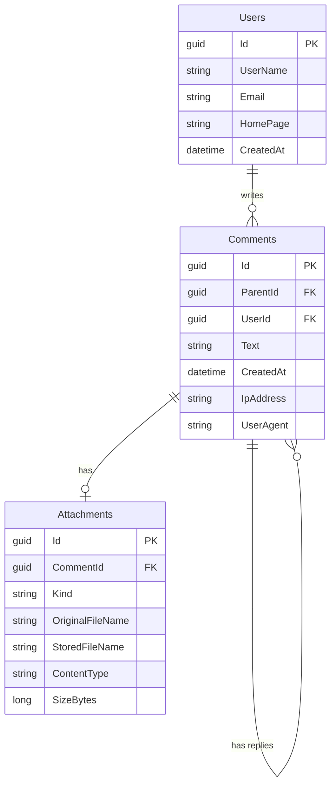

# Comments

SPA-приложение «Комментарии»: пользователи оставляют сообщения с каскадными ответами, картинками и текстовыми файлами. Все данные, включая сведения о клиенте (IP-адрес и User-Agent), сохраняются в реляционной базе данных.

Серверная часть: ASP.NET Core (.NET 10) + Entity Framework Core + MS SQL Server. Клиентская часть: Angular 22. Всё упаковано в Docker.

## Возможности

- **Форма комментария**
  - `User Name` (латиница и цифры) и `E-mail`: обязательные поля.
  - `Home page` (URL): необязательное поле.
  - `CAPTCHA`: картинка с кодом из латинских букв и цифр, одноразовая, действует 5 минут.
  - `Text`: обязательное поле, разрешены только теги `<a href="" title="">`, `<code>`, `<i>`, `<strong>`.
  - Панель кнопок `[i]`, `[strong]`, `[code]`, `[a]` и предпросмотр сообщения без перезагрузки страницы.
  - Валидация на клиенте и на сервере.
- **Главная страница**
  - Заглавные комментарии выводятся таблицей с сортировкой по `User Name`, `E-mail` и дате (в обе стороны). По умолчанию новые сверху (LIFO).
  - 25 комментариев на странице.
  - Каскадные ответы: на любой комментарий можно отвечать неограниченное число раз.
- **Файлы**
  - Картинки JPG, GIF, PNG: пропорционально уменьшаются до 320×240 (GIF сохраняется как PNG, анимация не поддерживается).
  - Текстовые файлы TXT до 100 КБ.
  - Просмотр файлов с визуальными эффектами (lightbox).

## Стек

| Область | Технологии |
|---|---|
| Backend | .NET 10, ASP.NET Core Web API, Entity Framework Core |
| База данных | MS SQL Server 2022 |
| Frontend | Angular 22 (standalone-компоненты, signals), SCSS |
| Валидация | FluentValidation, собственный валидатор XHTML-разметки |
| Защита от XSS | HtmlSanitizer (белый список тегов) |
| Изображения и CAPTCHA | SkiaSharp |
| Тесты | xUnit (backend), Jasmine/Karma-совместимый раннер Angular CLI (frontend) |
| Инфраструктура | Docker, Docker Compose, nginx |

## Быстрый старт (Docker)

Нужен только установленный Docker (с Docker Compose).

```bash
git clone https://github.com/maksimka1267/Comments.git
cd Comments
docker compose up --build
```

Первая сборка занимает несколько минут. Когда все три контейнера запустятся, откройте **http://localhost:8080**.

База данных создаётся и обновляется автоматически при старте API. Данные и загруженные файлы хранятся в Docker-томах и переживают перезапуск.

Полная очистка вместе с данными:

```bash
docker compose down -v
```

### Конфигурация

Значения по умолчанию подходят для локального запуска. Для сервера их можно переопределить в файле `.env` рядом с `docker-compose.yml`:

| Переменная | По умолчанию | Назначение |
|---|---|---|
| `MSSQL_SA_PASSWORD` | `Comments_Dev123!` | Пароль администратора SQL Server (должен проходить требования сложности) |
| `WEB_PORT` | `8080` | Порт, на котором доступно приложение |

## Разработка без Docker для приложения

Нужны: .NET 10 SDK, Node.js 22.12+ (или 24) и Docker для базы данных.

1. Запустить только базу данных:

   ```bash
   docker compose up -d mssql
   ```

2. Применить миграции и запустить API (профиль `https`, порт указан в `src/Comments.Api/Properties/launchSettings.json`):

   ```bash
   dotnet tool restore
   dotnet ef database update --project src/Comments.Infrastructure --startup-project src/Comments.Api
   dotnet run --project src/Comments.Api --launch-profile https
   ```

3. Запустить фронтенд (запросы `/api` проксируются на API через `web/proxy.conf.json`):

   ```bash
   cd web
   npm ci
   npm start
   ```

   Приложение откроется на http://localhost:4200. Если порт API отличается от `7186`, поправьте `target` в `web/proxy.conf.json`.

## Тесты

```bash
dotnet test                          # backend
cd web && npm test -- --watch=false  # frontend
```

## API

| Метод и путь | Описание |
|---|---|
| `GET /api/comments?sortBy=date\|userName\|email&sortDir=asc\|desc&page=1` | Страница заглавных комментариев (25 шт.) вместе с деревом ответов |
| `GET /api/comments/{id}` | Комментарий со всей веткой ответов |
| `POST /api/comments` | Создание комментария (`multipart/form-data`) |
| `GET /api/captcha` | Новая CAPTCHA: идентификатор и картинка (data-URI) |
| `GET /api/attachments/{id}` | Файл вложения |

Поля `POST /api/comments`: `userName`, `email`, `homePage`, `text`, `parentId` (для ответа), `captchaId`, `captchaAnswer` и необязательный `file`.

Ошибки валидации возвращаются в формате `ProblemDetails` (HTTP 400), если родительский комментарий не найден, то HTTP 404.

## Модель данных



Заглавные комментарии имеют `ParentId = NULL`, ответы ссылаются на родителя. Пользователь определяется парой `UserName` + `E-mail`. Для идентификации клиента в каждом комментарии сохраняются IP-адрес и User-Agent. Индексы подобраны под сортировку списка и выборку ответов.

## Безопасность

- **XSS.** Текст проверяется валидатором (все разрешённые теги закрыты и правильно вложены, то есть разметка валидна как XHTML), затем очищается санитайзером: остаются только `a`, `code`, `i`, `strong`, у ссылок только `href` и `title` и только схемы `http`/`https`. В базе хранится уже очищенный текст. Angular дополнительно санитайзит HTML при выводе.
- **SQL-инъекции.** Доступ к данным только через EF Core с параметризованными запросами.
- **CAPTCHA.** Код генерируется криптографическим генератором, проверка одноразовая, срок жизни 5 минут.
- **Файлы.** Тип определяется по содержимому, а не по расширению. Картинки перекодируются (метаданные и скрытые данные удаляются), есть защита от «бомб» с огромным разрешением. Файлы отдаются с `X-Content-Type-Options: nosniff` и `Content-Security-Policy: sandbox`, TXT всегда как `text/plain`. Имя файла на диске генерируется сервером, пути из запроса не используются.
- **IP клиента.** За nginx настоящий адрес берётся из заголовка `X-Forwarded-For`.

## Структура репозитория

```
src/
  Comments.Domain/          сущности и абстракции
  Comments.Infrastructure/  EF Core, миграции, файлы, CAPTCHA, обработка текста
  Comments.Api/             контроллеры, сервисы, валидаторы
tests/
  Comments.Tests/           модульные тесты backend
web/                        Angular-приложение (+ Dockerfile и конфигурация nginx)
docker-compose.yml          api, web (nginx), mssql
```

Зависимости направлены внутрь: `Api` → `Infrastructure` → `Domain`. Хранилища (файлы, CAPTCHA) спрятаны за интерфейсами и могут быть заменены без изменений остального кода.

## Работа с Git

Ветвление: `main` ← `develop` ← `feature/*`. Каждая функция разрабатывалась в отдельной ветке и вливалась в `develop` через merge-коммит. Сообщения коммитов в формате Conventional Commits (`feat:`, `fix:`, `chore:`, `docs:`).
